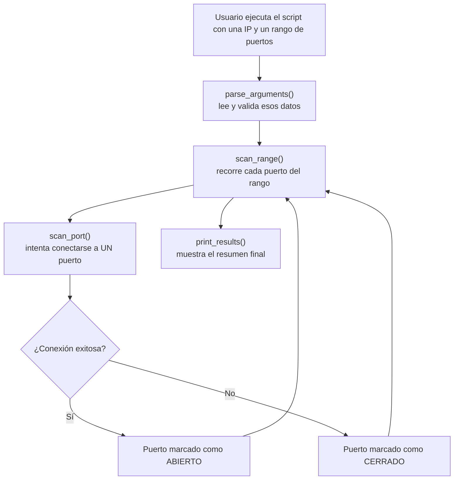

# Escáner de Puertos en Python

> Proyecto 1 de mi portafolio de ciberseguridad — construido desde cero para entender los fundamentos del reconocimiento de red (*network recon*), la base de cualquier pentest.

## ⚠️ Alcance de uso autorizado

Esta herramienta se desarrolló con fines educativos. Fue diseñada y probada **exclusivamente contra sistemas propios o expresamente autorizados por escrito** (en mi caso, `127.0.0.1` / mi propia máquina, y mi propia red doméstica, de la cual soy el titular). Escanear redes o sistemas de terceros sin autorización explícita es ilegal en la mayoría de jurisdicciones. El autor no se hace responsable del uso indebido de este código.

## Objetivo

Construir una herramienta en Python que determine qué puertos TCP están abiertos en una máquina, para entender de primera mano cómo funciona el reconocimiento de red, sin depender de herramientas ya existentes como Nmap.

## Alcance

**Incluido en esta versión (v1):**
- Escaneo de un rango de puertos TCP sobre una única dirección IP.
- Reporte de estado por puerto: abierto o cerrado.

**Excluido de esta versión (posibles mejoras futuras):**
- Escaneo de puertos UDP.
- Escaneo simultáneo de múltiples IPs / rangos de red.
- Detección de versión de servicio (*banner grabbing*).

## Arquitectura

El script se organiza en funciones separadas por responsabilidad (sin clases todavía — para el tamaño de esta herramienta, la programación orientada a objetos sería complejidad innecesaria):

```
port_scanner.py
├── parse_arguments()             # Lee IP y rango de puertos desde la terminal
├── scan_port(ip, port)           # Intenta conectarse a UN puerto. Devuelve abierto/cerrado
├── scan_range(ip, start, end)    # Recorre el rango de puertos, llamando a scan_port() por cada uno
├── print_results(results)        # Muestra el resumen final al usuario
└── main()                        # Orquesta todo: llama a las anteriores en orden
```

### Diagrama de flujo



## Modelo de amenazas y riesgos

| # | Riesgo | Causante | Probabilidad | Impacto |
|---|--------|----------|---------------|---------|
| 1 | Usar la herramienta contra un sistema sin autorización | El propio usuario | Media | Alto (legal/ético) |
| 2 | Escaneo demasiado agresivo (sin límites de velocidad) satura o afecta al objetivo | Diseño sin control de velocidad | Baja-Media | Medio |
| 3 | Entrada mal validada (rango de puertos absurdo, IP malformada) provoca un fallo inesperado | Falta de validación de entrada | Media | Bajo |
| 4 | Falsos negativos: un puerto realmente abierto se reporta como cerrado (por un firewall intermedio) | Limitación técnica del método de escaneo | Media | Bajo (interpretación errónea) |
| 5 | Publicar sin querer resultados de escaneos reales (IPs/hosts propios) en el repo público de GitHub | Descuido al documentar | Baja | Medio (exposición de información) |

**Riesgo prioritario:** el #1. Es la razón por la que este README abre con la sección de alcance de uso autorizado.

## Controles y buenas prácticas

| Riesgo | Control | Tipo |
|---|---|---|
| #1 Uso sin autorización | El programa pide confirmación explícita antes de escanear cualquier IP que no sea `127.0.0.1` o una red privada | Preventivo |
| #2 Escaneo agresivo / DoS involuntario | Timeout corto (1 segundo) por intento de conexión | Correctivo |
| #3 Entrada mal validada | Validar formato de IP y rango de puertos (1-65535) antes de escanear | Preventivo |
| #4 Falsos negativos | Documentado en este README: un puerto "cerrado" puede estar bloqueado por un firewall intermedio | Transparencia |
| #5 Publicar resultados reales sin querer | `.gitignore` que excluye resultados de escaneo | Preventivo |

## Checklist antes de dar por terminado el código

- [x] El README explica el alcance de uso autorizado
- [x] El programa valida IP y rango de puertos antes de escanear
- [x] Existe un timeout por conexión
- [x] Existe confirmación explícita antes de escanear una IP no-local
- [x] Está documentada la limitación de falsos negativos
- [x] Existe `.gitignore` para no subir resultados reales

## Requisitos

- Python 3.9 o superior (usa sintaxis de type hints moderna, ej. `list[int]`)
- Sin dependencias externas — todo el código usa únicamente la librería estándar de Python (`socket`, `argparse`, `ipaddress`)

## Uso

```bash
python port_scanner.py <ip> [-s puerto_inicial] [-e puerto_final]
```

Ejemplo real, escaneando mi propia máquina:

```
$ python port_scanner.py 127.0.0.1 -s 130 -e 150

Escaneando 127.0.0.1 en el rango de puertos 130-150...

Resultados del escaneo para 127.0.0.1:
  Puerto 135/tcp -> ABIERTO
```

Si la IP no es privada/local, el programa pide confirmación explícita antes de escanear:

```
$ python port_scanner.py 8.8.8.8 -s 1 -e 1
[!] 8.8.8.8 no es una IP privada/local. Confirmas que tienes autorizacion explicita para escanearla? (s/n): n
Escaneo cancelado: autorizacion no confirmada.
```

## Limitaciones conocidas

- El escaneo es secuencial (un puerto a la vez). Si un puerto está filtrado por un firewall, se espera el timeout completo (1s por defecto) antes de continuar — escanear rangos grandes puede ser lento. Una mejora real de v2 sería paralelizar con hilos.
- Solo reporta abierto/cerrado (no distingue "filtrado" como sí hace Nmap), por lo que un puerto realmente abierto pero bloqueado por un firewall intermedio se reportará como cerrado (falso negativo).
- La confirmación de autorización se basa en si la IP es privada — no es una garantía absoluta (una IP privada en una red compartida no es necesariamente "tuya").

## Lecciones aprendidas

- **Validar excepciones en los bordes del programa:** la primera versión de la validación de IP dejaba que `ValueError` se propagara sin capturar, mostrando un traceback técnico al usuario en vez de un mensaje claro. Se corrigió capturándola y usando `parser.error()`.
- **La lentitud no fue teórica:** durante las pruebas, escanear el rango por defecto (1-1024) tardó mucho más de lo esperado en Windows y tuvo que interrumpirse. Confirmó en vivo la limitación que ya habíamos anticipado en el modelo de amenazas (escaneo secuencial sin paralelismo) — reforzó la importancia de documentar limitaciones *antes* de que aparezcan como sorpresa.
- **El buffering de salida de Python:** al redirigir la salida del programa a un archivo en vez de verla directo en una terminal interactiva, no aparece nada hasta que el buffer interno se vacía — un detalle que puede confundir al depurar por qué "no pasa nada" cuando en realidad el programa sí está corriendo.

## Licencia

MIT — de uso libre, con atribución. Ver [LICENSE](LICENSE).

## Estado del proyecto

✅ Implementación completa y probada (escaneo de puertos cerrados, abiertos, y el control de autorización). Siguiente paso: publicar en GitHub.
